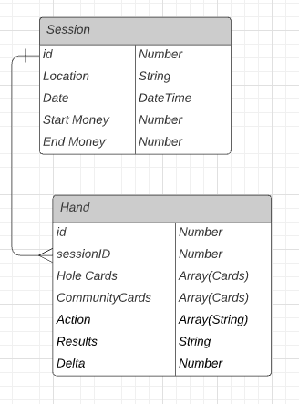

# Poker Hand API
An API for users to record and store various Hands of Texas Hold 'em that they have played during various Sessions

This app was built using Flask and mongoDB using a Flask wrapper called MongoEngine.

The database has two collections: Hands and Sessions.

Session has a one to many relation ship with hands: you can play many Hands in a single session.

## Relational Diagram

## Routes

### Get All Sessions
GET '/Sessions'

### Get Hands in Session
GET '/Sessions/\<id\>/Hands'

### Get Hand by ID
GET '/Hands/\<id\>'

### Add New Session
POST '/Sessions'

Example Input
``` json
{
    "location": "someplace",
    "start_money": 15,
    "end_money":20
}
```

### Delete Session
DELETE '/Sessions/\<id\>'

### Add New Hand
POST '/Sessions/\<id\>/Hands'

Example Input
``` json
{
    "card1_rank": "A",
    "card1_suit": "h",
    "card2_rank": "A",
    "card2_suit": "s",
    "action":"folded pre =]",
    "starting_stack": 100,
    "ending_stack":100
}
```

### Update Hand
PUT '/Hands/\<id\>'
``` json
{
    "card1_rank": "A",
    "card1_suit": "h",
    "card2_rank": "A",
    "card2_suit": "s",
    "action":"just kidding would never fold this",
    "starting_stack": 100,
    "ending_stack":300
}
```

### Delete Hand
DELETE '/Hands/\<id\>'

## Future Enhancements
I wanted to make a query route so users can search for hands meeting specific criteria across all sessions: such has hands that are suited, hands that are strongly connected, hands with rank > certain values
